# 安装Unity及下载apk文件过程

1. 安装Unity和Java相关软件

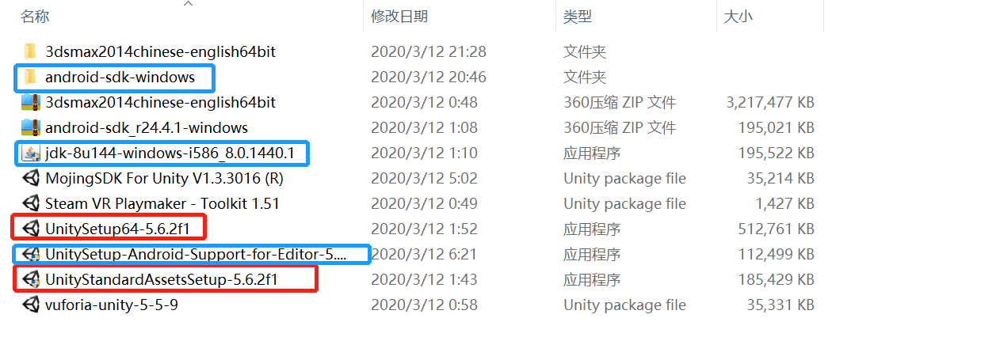

2. 将它们放在同一个容量足够大的盘，且用文件夹及名字标注好

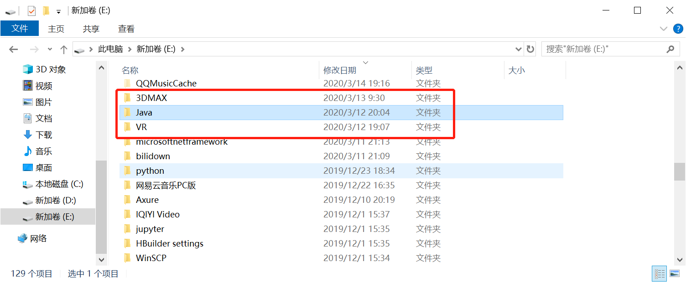

3. 检查一下Java的文件夹里是否含有这两个文件夹，若没有其中一个，则说明你把它下载到别的地方了，那要把它移回来

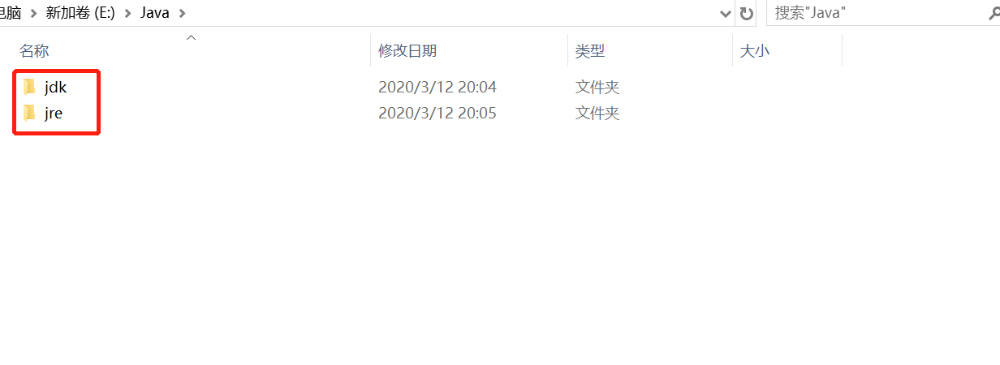

4. 确保上述步骤都完成后，右键“我的电脑”-点击“属性”-点击“高级系统设置”-点击“环境配置”

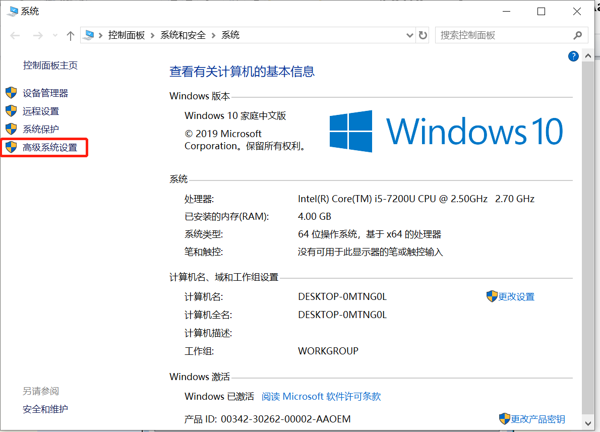

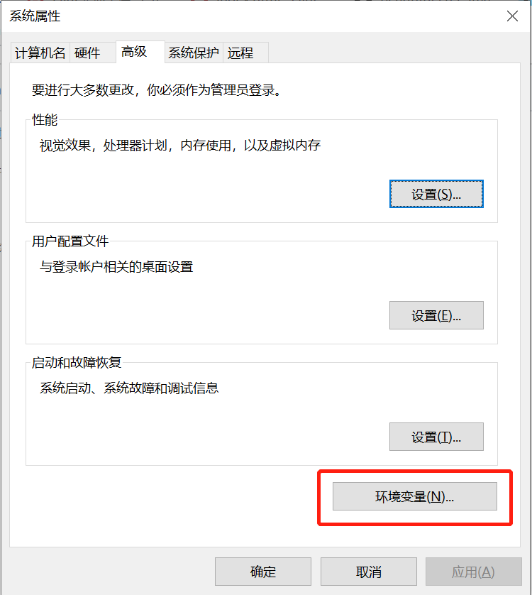

5. 新建一个变量名“JAVA_HOME”，变量值为“jdk”文件夹的摆放位置

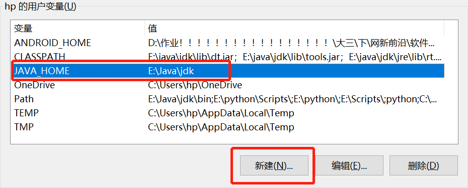

6. 找到并编辑“Path”，在它原有变量名的基础上新建加上“%JAVA_HOME%\bin”，按确定

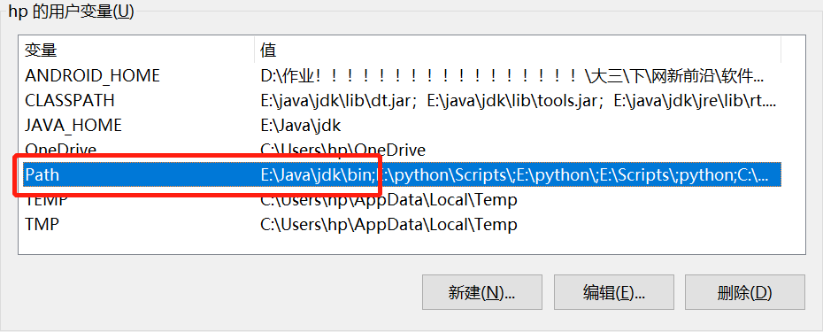

7. 打开Unity，进行Unity环境配置。点击上面工具栏中的“Edit”-点击“Preference”-找到“SDK""JDK”地址编辑区
   - SDK地址：直接输入/Browse选择 “android-sdk-windows”文件夹所在的路径
   - JDK地址：直接输入/Browse选择 “jdk”文件夹所在的路径

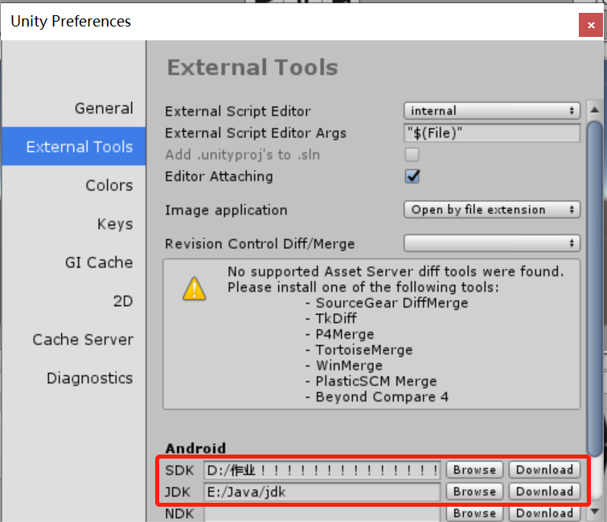

8. 完成之后点击“File”-点击“New scenes”，之后再点击“File”-“Build Settings”，左下方选择“Android”

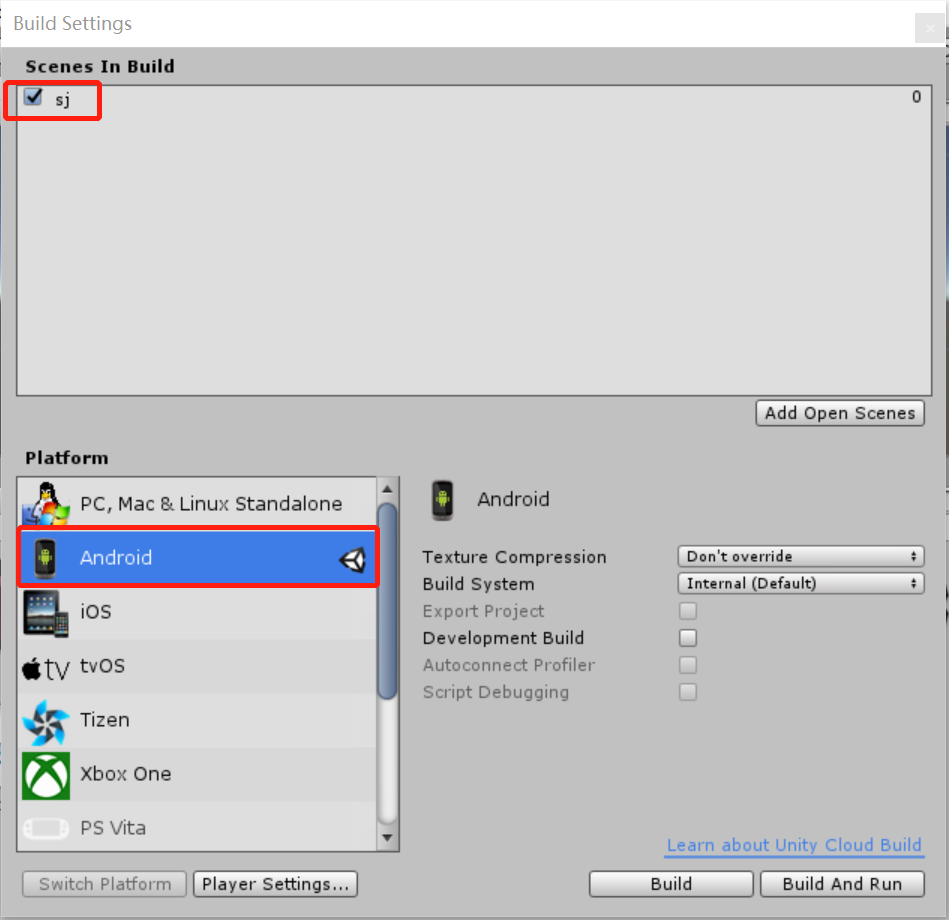

9. 点击左边最下面“Player Settings...”，找到“Other Settings”并自定义修改

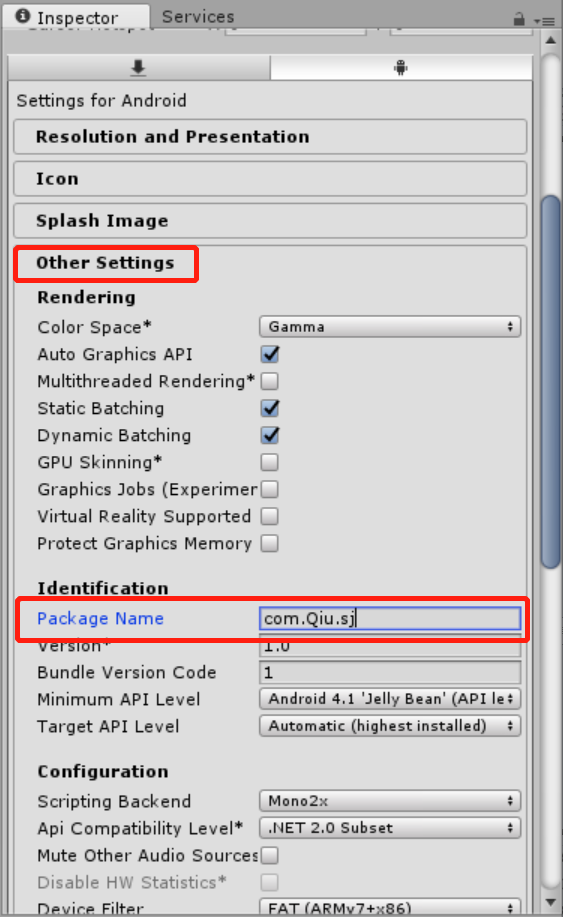

10. 最后按“Build”生成apk文件

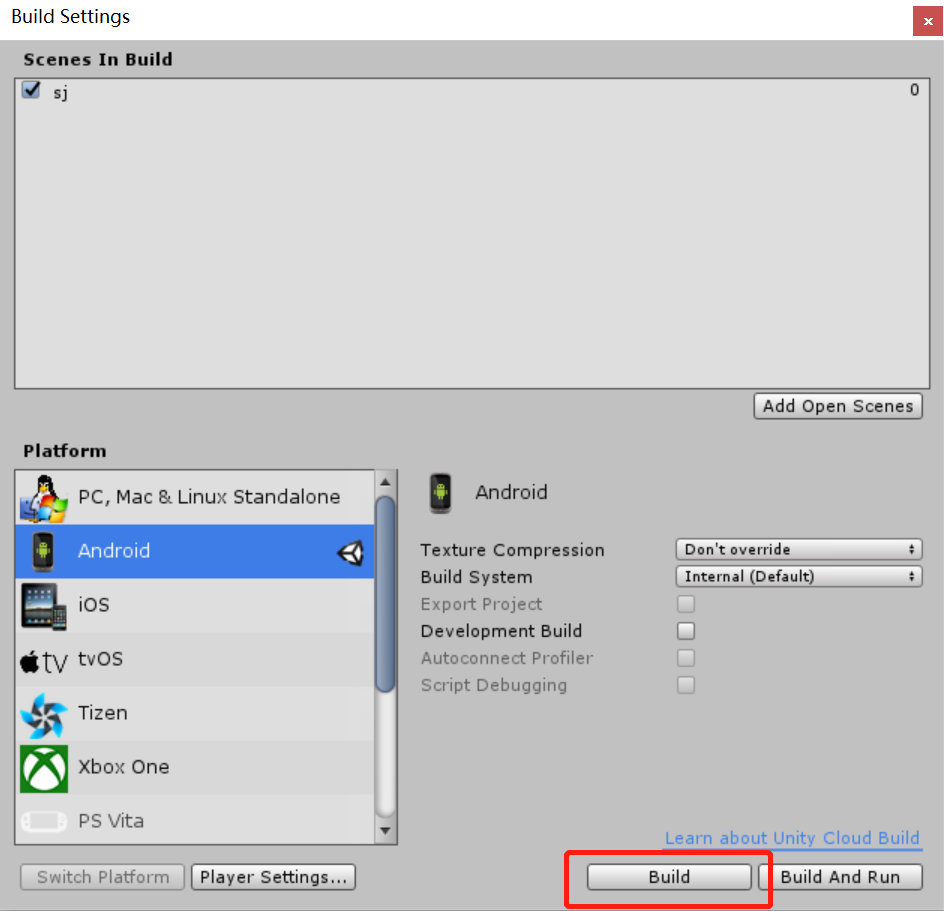

- 由于电脑录屏有点问题，便用手机设备录影

